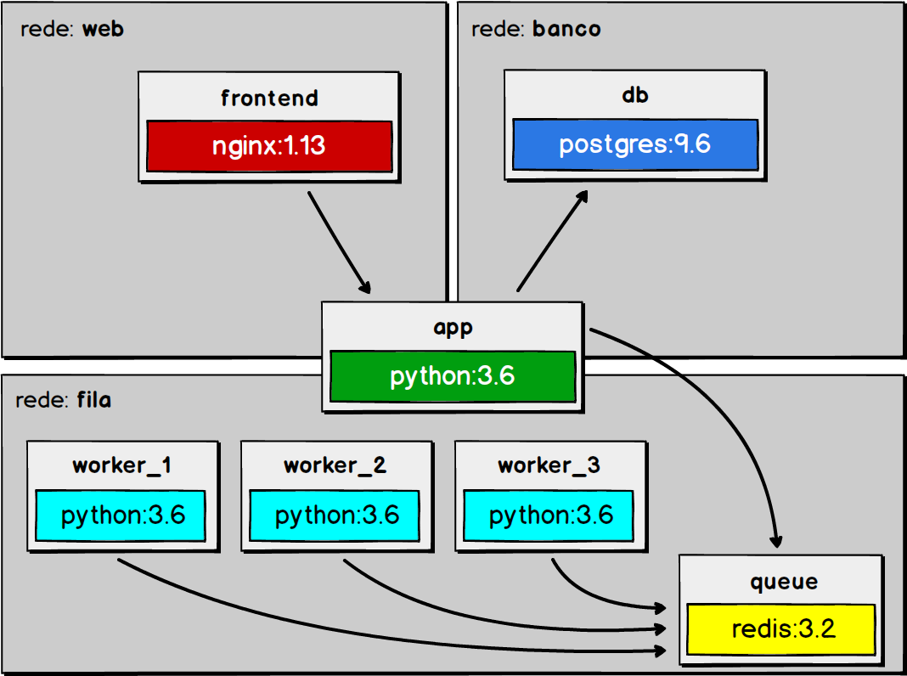
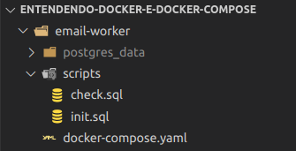
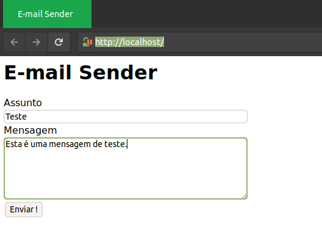
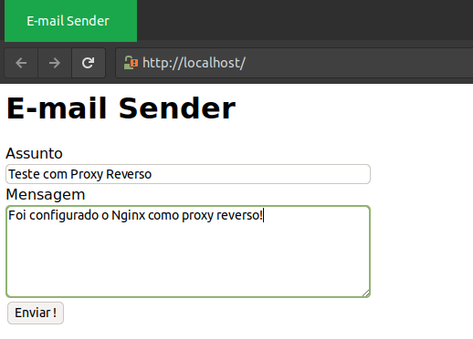

# Entendendo Docker e Docker Compose

O que um desenvolvedor de software precisa saber sobre Docker e Docker Compose?

Não tenho a intenção de explicar o que é Docker ou Docker Compose, muito menos de demonstrar como essas ferramentas são instaladas. As páginas de documentação das mesmas já o fazem de maneira simples e objetiva, então te convido a visitar os links abaixo e verificar como isto pode ser realizado no seu sistema operacional.

Página de documentação do [Docker](https://docs.docker.com/).

Página de documentação do [Docker Compose](https://docs.docker.com/compose/).

Vou tentar trazer as informações de maneira prática e objetiva, mas aumentando a complexidade das coisas aos poucos, como nós programadores aprendemos: precisamos abstrair a complexidade do problema a ser resolvido, ou seja, vamos dividir um "problemão" em pequenos problemas e resolvê-los por partes.

Mas para isso precisamos primeiro definir qual é o nosso problema e como vamos usar as ferramentas que temos disponíveis para chegar ao nosso objetivo.

Então vamos começar!

Antes de mais nada, não sou especialista em nenhuma das ferramentas que serão utilizadas neste "projeto", esta é uma forma que tenho para aprender mais e entender como as coisas funcionam. Teoria é importante, mas é vazia sem colocar o que você aprendeu em prática. 

E por que fazer tudo isso? 

Já faz um tempo que brinco com Docker, mas a algumas semanas atrás fiz um [bootcamp de Engenharia de Dados no IGTI](https://www.igti.com.br/custom/engenharia-de-dados/), onde foi apresentado o [Apache Airflow](https://airflow.apache.org/) pelo [Prof. Neylson Crepalde](https://www.linkedin.com/in/neylsoncrepalde/), com múltiplos containers. fiquei entusiasmado com aquilo.

Mas nada disso saiu do zero, há algum tempo eu adquiri um [curso de Docker do Prof. Leonardo Leitão da Cod3r](https://www.cod3r.com.br/courses/docker) , acho que você já notou que adoro fazer cursos e aprender coisas novas, e meu entusiasmo com o Airflow me fez agilizar o aprendizado de Docker e Docker Compose.

## Coordenando múltiplos containers

Vamos exemplificar a criação de uma aplicação com múltiplos serviços utilizando o Docker e o Docker Compose para orquestrar os mesmos. Então nosso primeiro passo é definir quais serão esses serviços e qual o objetivo desta aplicação.

Nosso projeto será uma aplicação simples para envio de e-mails com Workers, na realidade vamos criar a estrutura e simular esse envio. Para isso precisamos criar os componentes abaixo:

* Banco de Dados
* Servidor Web
* Gerenciador de filas
* Workers para envio de e-mail
* Aplicação principal

Podemos visualizar a estrutura final desses serviços conforme segue.



O Docker Compose usa um arquivo de configuração no padrão [YAML](https://yaml.org), que tem sua especificação neste [link](https://github.com/compose-spec/compose-spec/blob/master/spec.md). Mesmo que nas especificações atualizadas alguns detalhes da criação e conteúdo do arquivo *yaml* sejam diferentes do que as utilizadas neste projeto, por compatibilidade, vamos manter o padrão comumente aceito, ou seja, o nome do arquivo será `docker-compose.yaml`, a extensão *yml* também é aceita, e será informada a versão do mesmo.

## Iniciando com o banco de dados

Vamos utilizar o [PostgreSQL 9.6](https://www.postgresql.org) para persistir nosso dados, um detalhe no desenvolvimento de um projeto com vários serviços é utilizar uma versão específica dos componentes, isto vai evitar que sua aplicação quebre, pois no Docker, quando não é informada a versão, será utilizada a mais recente, com a tag *latest*.

```yaml
version: '3'
services:
  db:
    image: postgres:9.6
    environment:
      POSTGRES_PASSWORD: postgres
```
Aqui temos a estrutura básica do `docker-compose.yaml`, onde declaramos que estamos utilizando a versão 3, definindo as capacidades do docker-compose, este detalhe tentaremos explorar mais a fundo em outro momento. Note que foi informada uma variável de ambiente para definir uma senha para o usuário *postgres*, isto foi necessário pois as imagens oficiais do PostgreSQL passaram a exigir isto.

Para que a mágica aconteça, só precisamos digitar o comando abaixo, que levanta o serviço em modo *daemon*:

```bash
docker-compose up -d
```

Para verificar se o serviço subiu podemos usar ...

```bash
docker-compose ps
```

... similar ao *docker ps*, mas restrito apenas aos serviços indicados no `docker-compose.yaml`.

De forma similar, podemos executar um comando interno do PostgreSQL no container:

```bash
docker-compose exec db psql -U postgres -c '\l'
```

E finalmente podemos parar o serviço e remover o container, que foi declarado no `docker-compose.yaml` com o comando abaixo:

```bash
docker-compose down
```

Agora que já temos o nosso container PostgreSQL sendo executado, precisamos definir um volume para persistir esses dados, pois um container é efêmero, a partir do momento que ele for removido, tudo que estava dentro dele também é removido, ou seja, se foi criado um banco de dados no container, este banco de dados será removido também.
Para que isto não aconteça e os dados sejam perdidos, vamos dizer para nosso container onde esses dados serão armazenados e no nosso caso específico vamos criar um script de inicialização para criar e configurar o banco de dados que será usado na aplicação.

No nosso projeto vamos criar as pastas `postgres_data` e `scripts`, como pode ser observado na imagem abaixo.



Em `scripts`, vamos gerar 2 arquivos: *init.sql*, onde vamos criar o banco de dados `email_sender` e definir a tabela `emails`, no arquivo *check.sql*, vamos listar os bancos de dados, conectar no banco `email_sender` e mostrar como a tabela `emails` está configurada.

__*scripts/init.sql*__
```sql
CREATE DATABASE email_sender;

\c email_sender

CREATE TABLE emails (
  id SERIAL NOT NULL,
  data TIMESTAMP NOT NULL DEFAULT CURRENT_TIMESTAMP,
  assunto VARCHAR(100) NOT NULL,
  mensagem VARCHAR(250) NOT NULL
);
```

__*scripts/check.sql*__
```sql
\l
\c email_sender
\d emails
```

Para que tudo isso funcione, vamos aos ajustes necessários no arquivo `docker-compose.yaml`.

```yaml
version: '3'
volumes:
  dados:
services:
  db:
    image: postgres:9.6
    environment:
      POSTGRES_PASSWORD: postgres
    volumes:
      # volume dos dados
      - ./postgres_data:/var/lib/postgresql/data
      # scripts
      - ./scripts:/scripts
      - ./scripts/init.sql:/docker-entrypoint-initdb.d/init.sql
```

Para maiores informações sobre como utilizar um script de inicialização no container do PostgreSQL, procure a sessão [Initialization scripts](https://hub.docker.com/_/postgres) na página do Docker Hub.

Agora podemos subir o container e verificar se o banco de dados e a tabela configurados acima foram realmente criados.

```bash
docker-compose up -d

docker-compose exec db psql -U postgres -f /scripts/check.sql
```

## Vamos ao Front-End

Nosso próximo passo é criar um serviço web, para isto vamos utilizar o [Nginx](https://nginx.org), que neste primeiro momento proverá apenas uma página estática simples, sem nenhuma ação por trás. Para isso vamos ajustar o nosso arquivo `docker-compose.yaml` e criar um volume, onde será gerado um arquivo *index.html*.

```yaml
version: '3'
volumes:
  dados:
services:
  db:
    image: postgres:9.6
    environment:
      POSTGRES_PASSWORD: postgres
    volumes:
      # volume dos dados
      - ./postgres_data:/var/lib/postgresql/data
      # scripts
      - ./scripts:/scripts
      - ./scripts/init.sql:/docker-entrypoint-initdb.d/init.sql
  frontend:
    image: nginx:1.13
    volumes:
      # página web
      - ./web:/usr/share/nginx/html/
    ports:
      - 80:80
```
__*web/index.html*__
```html
<html>
    <head>
        <meta charset='uft-8'>
        <title>E-mail Sender</title>
        <style>
            label { display: block; }
            textarea, input { width: 400px; }
        </style>
    </head>
    <body class="container">
        <h1>E-mail Sender</h1>
        <form action="">
            <div>
                <label for="assunto">Assunto</label>
                <input type="text" name="assunto">
            </div>

            <div>
                <label for="mensagem">Mensagem</label>
                <textarea name="mensagem" cols="50" rows="6"></textarea>
            </div>

            <div>
                <button>Enviar !</button>
            </div>
        </form>
    </body>
</html>
```

Note que o `form action` ainda está vazio, portanto o formulário que foi criado não fará nada, por enquanto.

Depois de subir os serviços, podemos verificar o log dos mesmos pelo comando abaixo:

```bash
docker-compose logs -f -t
```

## Chegamos na aplicação

Já temos nosso banco de dados disponível e um front-end, agora precisamos iniciar o desenvolvimento do aplicativo, onde vamos usar o [Python](https://www.python.org) para enfileirar as mensagens incluídas no front-end.

Para facilitar nosso trabalho será usado um micro web-framework, o [Bottle](https://bottlepy.org), portanto será necessário instalar esta dependência no container do Python que vamos utilizar.

Vamos criar uma nova pasta `app` onde será configurado um volume e na mesma vamos criar o arquivo `app.sh`, onde será instalada nossa dependência através do comando [pip](https://packaging.python.org/tutorials/installing-packages/#installing-from-pypi).

__*app/app.sh*__
```bash
#!/bin/sh

# instalando dependência
pip install bottle==0.12.13

# subindo nossa aplicação
python -u sender.py
```

Como podem notar, estamos chamando um programa Python `sender.py`, que também será criado dentro do mesmo volume `app`.

__*app/sender.py*__
```python
# importando pacote
from bottle import route, run, request

# criando uma rota no raiz, que atende requisições POST
@route('/', method='POST')

# método que irá gravar no banco dados, mas por enquanto 
# só vamos retornar uma mensagem formatada do formulário 
# submetido pelo front-end
def send():
    assunto = request.forms.get('assunto')
    mensagem = request.forms.get('mensagem')
    return 'Mensagem enfileirada! Assunto: {} Mensagem: {}'.format(
      assunto, mensagem
    )

# chamando o método na porta 8080
if __name__ == '__main__':
    run(host='0.0.0.0', port=8080, debug=True)
```

Precisamos ajustar o `index.html` para que a requisição do formulário seja realizada para o método Python acima.

__*web/index.html*__
```html
<html>
    <head>
        <meta charset='uft-8'>
        <title>E-mail Sender</title>
        <style>
            label { display: block; }
            textarea, input { width: 400px; }
        </style>
    </head>
    <body class="container">
        <h1>E-mail Sender</h1>
        <form action="http://localhost:8080" method="POST">
            <div>
                <label for="assunto">Assunto</label>
                <input type="text" name="assunto">
            </div>

            <div>
                <label for="mensagem">Mensagem</label>
                <textarea name="mensagem" cols="50" rows="6"></textarea>
            </div>

            <div>
                <button>Enviar !</button>
            </div>
        </form>
    </body>
</html>
```

E finalmente, vamos ajustar nosso `docker-compose.yaml` para disponibilizar esse novo container.

```yaml
version: '3'
volumes:
  dados:
services:
  db:
    image: postgres:9.6
  volumes:
    # volume dos dados
    - dados:/var/lib/postgresql/data
    # scripts
    - ./scripts:/scripts
    - ./scripts:init.sql:/docker-entrypoint-initdb.d/init.sql
  frontend:
    image: nginx:1.13
    volumes:
      # página web
      - ./web:/usr/share/nginx/html/
    ports:
      - 80:80  
  app:
    image: python:3.6
    volumes:
      # aplicação
      - ./app:/app
    working_dir: /app
    command: ./app.sh
    # porta Bottle
    ports:
      - 8080:8080
```
Vamos verificar se ficou algum serviço executando?

```bash
docker-compose ps
```

Se estiver com algum serviço em execução, vamos pará-lo antes de iniciar nossos containers novamente.

```bash
docker-compose down
```

Agora sim, podemos levantar nossos serviços...

```bash
docker-compose up -d
```
Ao iniciar os serviços do `docker-compose` você deve receber uma mensagem de erro, provavelmente deste jeito:

```
ERROR: for email-worker_app_1  Cannot start service app: OCI runtime create failed:
container_linux.go:367: starting container process caused: exec: "./app.sh": permission denied: unknown
```
O que acontece é que nosso `script sh` não tem permissão de execução, há várias maneiras de solucionar isso, vou usar aquela que considero mais simples, na linha onde chamamos o *script*, altere como abaixo:

```yaml
app:
    image: python:3.6
    volumes:
      # aplicação
      - ./app:/app
    working_dir: /app
    command: bash ./app.sh
    # porta Bottle
    ports:
      - 8080:8080
```

Depois de implementada a alteração no `docker-compose.yaml`, já sabe, precisamos verificar se ficou algum serviço executando, parar os mesmos e levantar novamente.

Vamos verificar como estão nossos serviços do docker?

```bash
docker-compose logs -f -t
```

Podemos testar nosso aplicação acessando no navegador o link http://localhost



E temos um retorno da mensagem formatada, conforme definimos na nossa aplicação Python.


Como você notou temos 2 serviços respondendo em portas diferentes, desta forma conseguimos acessar nossa aplicação diretamente, pelo link http://locahost:8080. Será apresentado um erro, mas o serviço da aplicação pode ser acessado sem passar pela página web.


Para que isto não ocorra vamos configurar um [Proxy Reverso no Nginx](https://docs.nginx.com/nginx/admin-guide/web-server/reverse-proxy/), desta forma não será mais necessário deixar a porta 8080 exposta.

Aqui vale explicar um detalhe sobre o Docker Compose, quando você cria vários containers no ambiente do `compose`, um container tem acesso aos outros, desde que eles não sejam segregados em redes separadas. Portanto o container `frontend` consegue acessar o container `app` e é justamente isso que vamos usar para configurar nosso proxy reverso.

A primeira coisa que precisamos fazer é criar o arquivo de configuração do proxy reverso, para isso crie um volume `nginx` como um arquivo de nome `default.conf`, que terá o conteúdo abaixo:

```bash
server {
    listen 80;
    server_name localhost;

    location / {
        root /usr/share/nginx/html;
        index index.html index.htm;
    }

    error_page 500 502 503 504 /50x.html;
    location = /50x.html {
        root /usr/share/nginx/html;
    }

    # proxy reverso
    location /api {
        proxy_pass http://app:8080/;
        proxy_http_version 1.1;
    }
}
```
Vamos precisar ajustar o arquivo `docker-compose.yaml`, incluindo o volume `nginx` no serviço `frontend` e excluindo a porta 8080 do nosso serviço `app'.

```yaml
version: '3'
volumes:
  dados:
services:
  db:
    image: postgres:9.6
  volumes:
    # volume dos dados
    - dados:/var/lib/postgresql/data
    # scripts
    - ./scripts:/scripts
    - ./scripts:init.sql:/docker-entrypoint-initdb.d/init.sql
  frontend:
    image: nginx:1.13
    volumes:
      # página web
      - ./web:/usr/share/nginx/html/
      # configuração proxy reverso
      - ./nginx/default.conf:/etc/nginx/conf.d/default.conf
    ports:
      - 80:80  
app:
    image: python:3.6
    volumes:
      # aplicação
      - ./app:/app
    working_dir: /app
    command: bash ./app.sh
```

Por último, vamos alterar o atributo *action* do *index.html* conforme abaixo.

```html
<html>
    <head>
        <meta charset='uft-8'>
        <title>E-mail Sender</title>
        <style>
            label { display: block; }
            textarea, input { width: 400px; }
        </style>
    </head>
    <body class="container">
        <h1>E-mail Sender</h1>
        <form action="http://localhost/api" method="POST">
            <div>
                <label for="assunto">Assunto</label>
                <input type="text" name="assunto">
            </div>

            <div>
                <label for="mensagem">Mensagem</label>
                <textarea name="mensagem" cols="50" rows="6"></textarea>
            </div>

            <div>
                <button>Enviar !</button>
            </div>
        </form>
    </body>
</html>
```
Vamos subir nossos serviços e verificar o resultado.



Com o envio dos dados para a aplicação, temos o retorno, mas veja o detalhe do link, *http://localhost/api*.


